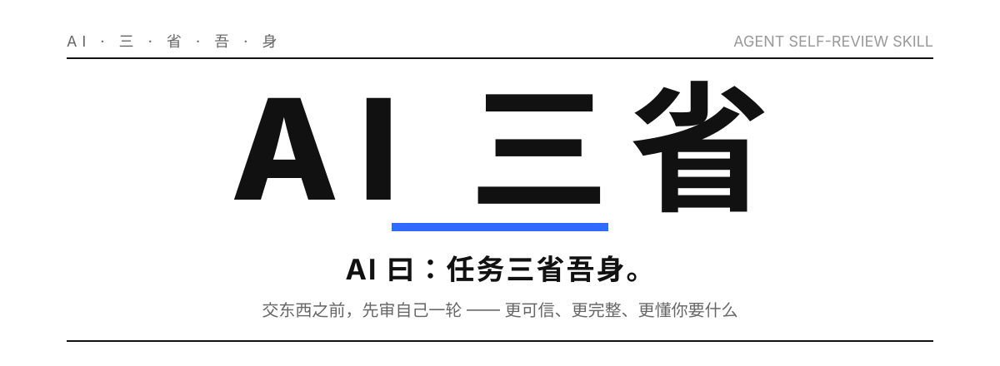

<p align="center">
  
</p>

<p align="center">
  
  
  
  
  
</p>

## 它解决一个具体的毛病

AI 交东西，几乎总是一副"搞定了"的口气。

可你一读就发现：引的数据没出处，你要的三件事它只做了两件，或者它答得很流畅——但答的根本不是你想问的那个。于是你只能自己当质检员，一遍遍追问"这个查过吗""那个呢"，逼它把漏洞一个个吐出来。

这不是 AI 笨。这是**反馈回路缺了一环**：写东西的那颗脑子，天然看不见自己的漏洞。它在自己的思路里，会不自觉替自己辩护。

AI 三省就补这一环。在 AI 说"搞定了"之前，逼它先停一下，换成一个挑剔审稿人的眼光，把刚写的东西当成**别人交上来的作业**来挑刺，挑完再改，然后才交给你。

## 三省，是哪三省

名字取自曾子"吾日三省吾身"。三省，就是交付前必须站得住的三根轴：

<p align="center">
  
</p>

- **一省 · 可信**——里面有没有编的？每个数字、名字、结论，说得出从哪来吗？语气很肯定，不等于事情是真的。
- **二省 · 完整**——你要的每一件，它都做了吗？最常见的翻车是"做 A 顺便 B"，结果只做了 A，B 悄悄没了。
- **三省 · 合意**——它答的，是你真正想要的那个吗？还是在精准地回答一个错的问题？你要的是结论还是过程、草稿还是终稿，它拿捏对了吗？

三根轴同时站得住，才算真做完。

## 为什么换个视角就管用

这是整件事的关键，也是它跟"再检查一遍"最不一样的地方。

<p align="center">
  
</p>

同一颗脑子、同一个思路里做的"自查"，基本是走过场——让缺陷藏起来的那个盲点，正是当初造成缺陷的那个盲点。它会一路点头："嗯，没问题，挺好。"

所以三省的第一步是**强制换身份**：你现在不是作者，是一个没看过任何过程、只拿到成品和原始要求的审稿人。你的任务不是确认它没问题，是去证明它**不该被交付**。默认它有毛病，然后去找。

如果运行环境支持起子代理，这一招还能升级成**独立批评者**：另起一个全新上下文，只喂给它"原始要求 + 最终成品",不给它你的思考过程。新上下文挑刺最狠，也最诚实。环境不支持就退回内置自省，一样能用。

## 它跑起来是什么样

自省不是打个分就完事，是一个"换视角 → 挑刺列清单 → 修正"的短循环，最多三轮。三轮还没干净，它不装完美，直接把剩下的问题摊给你：

<p align="center">
  
</p>

一次真实的自省，长这样：

```
🪞 AI 三省
一省·可信：发现 1 个问题
  - [高] 引用的季度数据无来源 —— 你只给了月度数据，季度值是我自己推算的
二省·完整：发现 1 个问题
  - 子诉求覆盖 2/3；漏了："顺便给个一句话摘要"
三省·合意：通过 —— 要的是终稿、要判断，形态对上了

已修正：补上摘要；季度数据标注为"推算，待核"
仍存疑：无
```

然后才给你改好的成品。三省全过、确实不用改，它就一句"三省已过，无需修正"直接交，不给你演一出仪式。

## 它凭什么比"你自己盯"强

- **省掉你当质检员的那几轮**——漏洞在交到你手上之前就被挑出来、补上了。
- **不许它嘴上说"我查过了"**——每个"通过"都得指得出依据：哪段话、哪个数、回读了哪个文件。指不出的，一律当没查。
- **不许它偷偷放水**——发现没达标，是改产出，不是把标准悄悄调低。放宽要求只能你点头。
- **不许它装完美**——还剩没搞定的，明明白白列给你。一份标了"这两处待核"的东西，比一份看着完美却藏着雷的东西可信。

## 怎么用

- **喊它**：`/ai-sanxing`，或者直接说"交付前三省一下 / 认真核对再给我 / 别糊弄我"。
- **让它自己来**：AI 快要说"已完成/搞定/如上"、或刚写完一份有分量的东西时，自动触发。
- **设成默认**：在宿主 Agent 的 `AGENTS.md` / `CLAUDE.md` 里加一句"收尾前先按 AI 三省自审一轮"。

## 装它

一个技能就是一个文件夹，放进宿主 Agent 的技能目录就行：

```bash
mkdir -p ~/.claude/skills/ai-sanxing        # Claude Code
# 或 ~/.trae/skills/ai-sanxing、~/.codex/skills/ai-sanxing 等对应目录
cp -r ai-sanxing/* <你的技能目录>/ai-sanxing/
```

`references/checklist.md` 是三省的完整检查清单，AI 写自省清单时按需翻。

## Agent 通用性

纯提示词，零运行时依赖，不绑任何一家。凡是能读技能、能读提示词的 Agent 都能用：

| Agent | 技能目录 | 能不能用 |
| --- | --- | --- |
| Claude Code | `~/.claude/skills/` | ✅ 原生支持 SKILL.md |
| Codex | `~/.codex/skills/` | ✅ 读 SKILL.md frontmatter |
| TRAE CLI | `~/.trae/skills/` | ✅ 读 SKILL.md frontmatter |
| Cursor | 规则/技能目录 | ✅ 可作为规则或技能加载 |
| 其他 | 任意 | ✅ 把 SKILL.md 当提示词喂进去即可 |

之所以到处都能跑，是因为它没依赖任何一家的私有能力：不调工具、不跑脚本、不碰特定 API。核心就是一套让模型换视角挑刺的指令。"独立子代理批评者"是可选增强——环境有子代理能力就升级，没有就退回内置自省，不影响主流程。

## 文件结构

```
ai-sanxing/
├── SKILL.md                  # 技能本体（入口）
├── README.md                 # 本文件
├── LICENSE                   # MIT
├── references/
│   └── checklist.md          # 三省完整检查项 + 判定话术
└── assets/                   # README 配图
```

## 它不管什么

- **纯闲聊、查时间、改个错字**这类没什么可审的——它会说一句"不必自省"，直接给你，不浪费一轮。
- **它不是代跑测试的**——工程任务里的 exit code、单测，还是交给你的测试工具；三省管的是语义层面的可信、完整、合意。

## License

[MIT](LICENSE)
