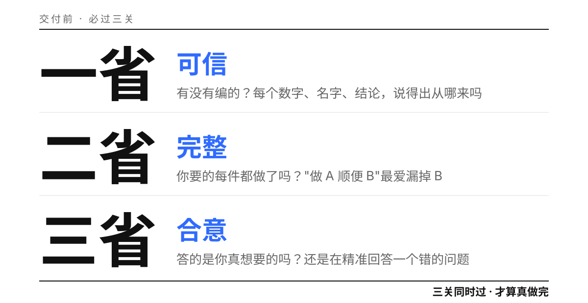
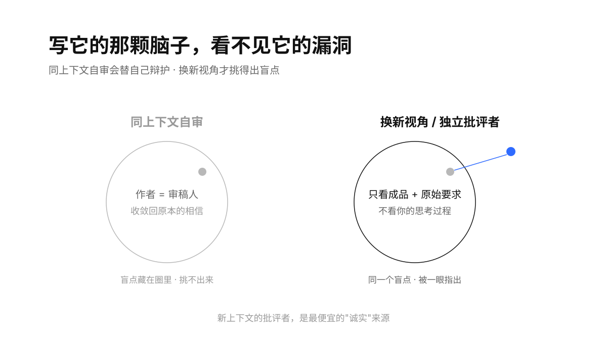
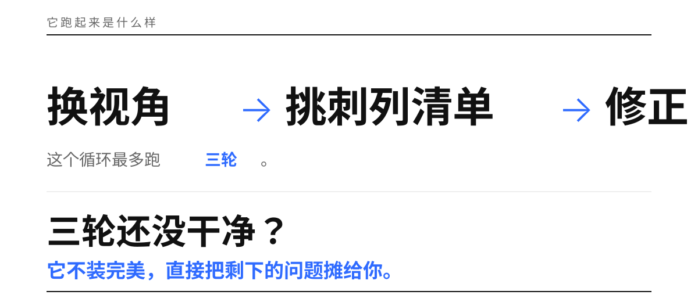

# AI 三省 · 吾日三省吾身

> "吾日三省吾身：为人谋而不忠乎？与朋友交而不信乎？传不习乎？" —— 曾子《论语·学而》

<p align="center">
  
  
  
  
  
</p>

**让 Agent 在交付前先审自己一轮，再交给你——更可信、更完整、更懂你要什么。**

一个跨 Agent 的轻量技能（纯提示词，单文件即可用）。它在 Agent 即将说"搞定了"之前踩一脚刹车，换成挑剔审稿人的视角，从三个轴上挑刺并修正：

<p align="center">
  
</p>

- **一省 · 可信**——有没有编造、结论有没有据、语气自信 ≠ 事实。
- **二省 · 完整**——用户的每个子诉求是否都覆盖，有没有偷偷丢一半。
- **三省 · 合意**——答的是不是用户真正想要的意图，而不是字面。

名字取自曾子"吾日三省吾身"。它治的不是能力，是**反馈回路**：写东西的那颗脑子天然看不见自己的漏洞，本技能强制它跳出来。

<p align="center">
  
</p>

## 为什么不是又一个自审工具

同类里成熟的方案（verified-task、did-it-actually、Anthropic Outcomes）几乎都**面向代码/工程任务**、偏英文、靠跑测试和挂 exit code 来校验。AI 三省的差异：

- **面向任意交付物**——飞书文档、报告、方案、邮件、中文写作、结构化数据都行，不依赖测试。
- **中文原生**，贴合文档/HR/战略稿这类语义交付。
- **稳定的三轴框架**（可信/完整/合意），而不只做"请求保真"或"文风"单一维度。
- **零依赖、好移植**，任何能读提示词的 Agent 都能用。

同时它复用了同类被验证的四条硬核套路：**换新视角审、证据高于声称、硬迭代上限、诚实交底**。

## 怎么用

- **显式**：`/ai-sanxing`，或对 Agent 说"交付前三省一下 / 认真核对再给我 / 别糊弄"。
- **自动**：在 Agent 即将输出"已完成/搞定/如上"、或刚产出一份较重的交付物时自动触发。
- **设为默认**：在宿主 Agent 的 `AGENTS.md` / `CLAUDE.md` 里加一条"收尾前先按 AI 三省自审"。

## 它会输出什么

自省不是一次性打分，而是一个"换视角 → 挑刺 → 修正"的短循环，最多三轮，到顶就诚实交底：

<p align="center">
  
</p>

```
🪞 AI 三省
一省·可信：发现 1 个问题
  - [高] 引用的季度数据无来源 —— 用户只给了月度数据，季度值系推算
二省·完整：发现 1 个问题
  - 子诉求覆盖 2/3；漏了："顺便给个一句话摘要"
三省·合意：通过 —— 形态/深度/口吻均对齐

已修正：补上摘要；季度数据标注为"推算，待核"
仍存疑：无
```

然后给出修正后的最终交付物。三省全过则一句"三省已过，无需修正"直接交付，不制造仪式感。

## 安装

单文件即可用。放进宿主 Agent 的技能目录，例如：

```bash
mkdir -p ~/.claude/skills/ai-sanxing        # Claude Code
# 或 ~/.trae/skills/ai-sanxing 等对应目录
cp -r ai-sanxing/* <你的技能目录>/ai-sanxing/
```

`references/checklist.md` 是三省的完整可操作检查项，Agent 写自省清单时按需加载。

## 文件结构

```
ai-sanxing/
├── SKILL.md                  # 技能本体（入口）
├── README.md                 # 本文件
├── LICENSE                   # MIT
├── references/
│   └── checklist.md          # 三省完整检查项 + 判定话术
└── assets/                   # README 配图（Geometry Blue）
```

## 边界

- 不适用于纯闲聊、查时间、一行小改这类没有可审对象的琐碎请求——技能会一句话说明"不必自省"并直接交付。
- 不改标准迁就产出；放宽要求只能由用户授权。
- 硬上限 3 轮，到顶如实交底，不假装完美、不无限打转。
